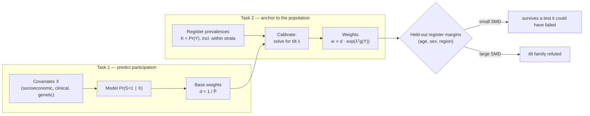

# i3pw — theory

Start at the [README](../README.md) if you have not. This file answers the
[second research question](../README.md#the-research-question): *what do the weights
actually identify?*

**The whole file in one paragraph.** A biased sample and its population differ by a
density ratio. Assume that ratio is log-linear — a covariate part plus an outcome part,
$a(X) + \theta^\top g(Y)$. The covariate part is what a participation model estimates. The
outcome part is what a register's known prevalences pin down, because forcing the
reweighted sample to reproduce them is a moment condition whose dual is exactly a
log-linear tilt $e^{\lambda^\top g(Y)}$, with $\lambda$ playing the role of $\theta$. That
solve is an I-projection, it inherits the asymptotics of a regression estimator, and it is
falsifiable only through moments you deliberately did *not* constrain. Everything below is
that paragraph with the conditions attached.

In order: [notation](#notation), [what the method identifies](#what-is-identified) —
beginning with a case small enough to check by hand —
[where the construction comes from](#where-this-sits-density-ratios-i-projection-and-label-shift),
what follows for [estimation](#calibration-is-a-regression-estimator-and-why-the-ses-look-the-way-they-do)
and for [testing](#what-makes-this-falsifiable), the
[two tasks](#two-separable-tasks-predict-selection-then-anchor-to-the-population) the
package keeps apart with a [ladder of weights](#a-ladder-of-prevalence-informed-weights)
built on them, and the [bibliography](#references) for all three documents.

A reader who wants only one thing from this file probably wants
[what makes it falsifiable](#what-makes-this-falsifiable): it is the section that says
what would have to happen for the method to be wrong.

## Notation

Every symbol used in this file and in [guide.md](guide.md), in one place. Indices: $i$ runs
over sampled units ($n$ of them), $q$ over outcomes ($Q$), $a$ over strata ($A$).

| Symbol | Is | Where it comes from |
| --- | --- | --- |
| $S$ | participation indicator; $S = 1$ for the units you observe | the cohort |
| $X$ | covariates available on the sampling frame (socioeconomic, clinical, genetic) | the frame |
| $Y$ | the $Q$ binary outcomes (diagnoses), observed on participants | the cohort |
| $\pi(x, y) = \Pr(S = 1 \mid X = x, Y = y)$ | the true, unknown inclusion probability | never observed |
| $K_q = \Pr(Y_q = 1)$ | **known** population prevalence | a register or census |
| $P_q = \Pr(Y_q = 1 \mid S = 1)$ | sample prevalence — biased | the cohort |
| $g(Y)$ | the constrained functions: $Y$ itself, or $Y$ crossed with stratum indicators | your choice — the design decision |
| $d_i$ | base weights, typically $1 / \hat{\pi}(X_i)$ | your participation model (`base_weights=`) |
| $w_i$ | the calibration weights this package returns | the solve (`fit.weights`) |
| $\lambda$ | the fitted dual — the estimated tilt | the solve (`CalibrationDiagnostics.tilt`) |
| $a(X),\ \theta$ | the covariate-driven and outcome-driven parts of the *true* log density ratio | the world; $\theta$ is what $\lambda$ estimates |
| $\rho$ | the ridge on $\lambda$ that shrinks toward $d$ | `shrinkage=` / `ridge=` |

The one distinction to hold onto: $\theta$ is a property of reality, $\lambda$ is a number
this package computes, and the whole of [What is identified?](#what-is-identified) is the
question of when they are the same.

## What is identified?

### A case small enough to check by hand

Before the general statement, the simplest instance, which the reader can verify with a
pencil. One binary outcome, no covariates, a sample that is 20% cases ($P = 0.20$), and a
population known to be 40% cases ($K = 0.40$). Calibration solves for a single number
$\lambda$ and assigns weights proportional to $e^{\lambda Y}$. The constraint is that the
weighted case fraction equal $K$:

$$
\frac{P e^{\lambda}}{P e^{\lambda} + (1 - P)} = K
\qquad\Longrightarrow\qquad
\lambda = \log \frac{\mathrm{odds}(K)}{\mathrm{odds}(P)}
= \log \frac{0.40 / 0.60}{0.20 / 0.80} = 0.9808
$$

and therefore weights proportional to $K/P = 2.00$ for each case and
$(1-K)/(1-P) = 0.75$ for each control. Those are exactly the classical weights for a
choice-based sample with known population shares (Manski & Lerman 1977), which is
reassuring: the machinery had better reproduce what was already correct.
Running `entropy_balance(Y, [0.40])` returns `λ = 0.980829` and precisely those two
weights.

Two things are worth noticing, because both generalize:

- **$\lambda$ is interpretable.** It is the log odds-ratio between the population
  prevalence and the sample prevalence — a measure of how hard the sample had to be
  pushed. It is the $\theta$ of the selection model, recovered rather than assumed, and
  `CalibrationDiagnostics.tilt` reports it.
- **Nothing was estimated.** Given $K$, the answer is a closed form. The sample supplied
  $P$; the register supplied $K$; no model intervened. This is why the anchored margin
  later turns out to have *zero* sampling variance — there was never anything to estimate.

Everything below is this calculation with more moments, an arbitrary base weight, and
consequently no closed form.

### The general statement

**The assumption.** Write the **population-to-sample density ratio** — the reweighting
that turns the biased sample back into the population — as log-linear in the covariates
and outcomes:

$$
\log \frac{\mathrm{d}P_{\text{population}}}{\mathrm{d}P_{\text{sample}}}(X, Y)
\;=\; a(X) \;+\; \theta^\top g(Y)
$$

**What the package does.** Calibration returns the **minimum-divergence** weights

$$
w_i \;\propto\; d(X_i)\, \exp\!\big(\lambda^\top g(Y_i)\big)
$$

— the base $d(X)$ tilted by the smallest exponential factor — that reproduce the supplied
population moments $\mathbb{E}_w[g(Y)] = \text{target}$. This is a *density-ratio* model,
not a claim to have recovered each unit's inclusion probability. Three consequences:

- **Anchored margins are exact by construction.** The reweighted sample reproduces each
  known prevalence exactly — because that is the constraint. It is not evidence the method
  "works", only that it did what it was told.
- **Coincidence with true IPW is conditional.** These weights equal the true
  inverse-probability weights $1/\pi(X, Y)$ *only* when the density ratio genuinely lies in
  the tilt family — the base $d(X)$ captures the covariate-driven part, $g(Y)$ spans the
  outcome-driven part — and positivity holds (every relevant $(X, Y)$ region has sample
  support).
- **Transfer to other estimands is conditional too.** Downstream means, variance
  components, and effect sizes are recovered only insofar as this density-ratio model is
  adequate for them (see the effect-size/collider section for where it is *not*).

So the honest one-liner is **not** "we infer the true inverse-probability weights" but:
*we estimate minimum-divergence weights that reproduce the known population moments, and
they equal the true IPW weights when the population-to-sample density ratio is spanned by
the base weights plus those moments.* In symbols, the method is exact precisely when
$\lambda = \theta$ is attainable — when the true $a(X)$ is what $d$ supplies and the true
$\theta^\top g(Y)$ lives in the span of the moments you chose.

**Inverse vs odds base weights (`base_scheme`).** That separability is *exact* for one
familiar choice. Under logistic participation $\operatorname{logit} \pi = a(X) + \theta Y$,
the **inverse-odds** weight

$$
\frac{1 - \pi}{\pi} = e^{-a(X)} \cdot e^{-\theta Y}
$$

is exactly multiplicatively separable and log-linear, so it composes cleanly with the
$e^{\lambda Y}$ calibration tilt. The Horvitz–Thompson weight
$1/\pi = 1 + e^{-a(X) - \theta Y}$ is **not** separable; it only approaches the tilt family
as inclusion becomes rare ($\pi \to 0$, where $1/\pi \approx (1-\pi)/\pi$).
`calibration_ipw(base_scheme="odds")` uses the exactly-composing form; `"inverse"` (the
default) is the standard IPW weight and is very close under strong selection. When selection
is on the outcome alone (no covariates in the base), the two agree exactly — the reweighting
is a per-class constant either way, which is why the `K/P` weights of the
[liability-threshold study](studies.md#a-probit--liability-threshold-model-the-lee-et-al-transform-vs-ipw)
are exact IPW, not an approximation.

## Where this sits: density ratios, I-projection, and label shift

The construction is not ad hoc — it is one object seen through three established literatures,
and that is where its guarantees (and its boundary) come from.

- **An exponential-tilt density-ratio model.** Writing
  $\log \mathrm{d}P_{\text{pop}} / \mathrm{d}P_{\text{sample}} = a(X) + \theta^\top g(Y)$ is
  exactly the semiparametric *density-ratio* (exponential-tilt) model of Qin (1998) — the same
  tilt that underlies retrospective case-control sampling, where only the intercept shifts
  between prospective and separate-sample logistic fits (Anderson 1972; Prentice & Pyke 1979).
  The liability $K/P$ weights are its one-outcome special case.
- **Calibration is an I-projection.** The "minimum-divergence weights" are the *information
  projection* of the base weights onto the set of distributions meeting the moment constraints
  — minimize Kullback–Leibler divergence subject to linear constraints (Csiszár 1975; the
  minimum-discrimination-information principle, Kullback 1959). This is the optimization
  `entropy_balance` solves, in its primal and dual forms:

$$
\underbrace{\min_{w}\ \sum_i w_i \log \frac{w_i}{d_i}
  \quad \text{s.t.} \quad \sum_i w_i\, g(Y_i) = t,\ \ \sum_i w_i = 1}_{\text{primal: } n \text{ unknowns}}
  \qquad\Longleftrightarrow\qquad
  \underbrace{\min_{\lambda \in \mathbb{R}^{k}}\ \log \sum_i d_i\,
  e^{\lambda^\top (g(Y_i) - t)} + \tfrac{\rho}{2}\lVert\lambda\rVert^2}_{\text{dual: } k \text{ unknowns}}
  $$

  The dual is smooth, convex and tiny — one parameter per constraint, not per unit — and its
  solution gives back the primal weights as $w_i \propto d_i e^{\lambda^\top g(Y_i)}$. So
  entropy balancing (Hainmueller 2012) and empirical-likelihood calibration (Qin & Lawless
  1994) are two views of the same optimization. Matching population moments by reweighting is
  also what kernel mean matching does for covariate shift (Gretton et al. 2009). The ridge
  $\rho$ (`shrinkage=`) is the one term with no counterpart in the classical theory: it
  shrinks $\lambda$ toward $0$, i.e. $w$ toward $d$, trading exact calibration for variance.
- **This is label shift.** With no covariates in the base — pure
  `outcome_calibration_weights(Y, [K])` — i3pw *is* the classic correction for **prior
  probability shift / label shift**: sample and population differ only in the label marginal
  $P(Y)$, and the fix is to reweight the sample to the known priors (Saerens et al. 2002;
  Storkey 2009; Lipton et al. 2018). i3pw generalises it two ways: (i) it tilts an arbitrary
  base weight $d(X)$ from a participation model rather than uniform weights, and (ii) where
  black-box label-shift estimators must *infer* $P(Y)$ from a classifier, i3pw takes $P(Y)$ as
  a **known register quantity** — the regime where the correction is exact rather than estimated.

The placement also re-derives the honesty boundary. Label shift assumes the class-conditional
`P(X | Y)` is stable between sample and population — selection acts only *through* `Y` — which is
the exact analogue of "the density ratio lies in the tilt family" above. When selection also acts
*within* outcome classes, that assumption fails and so does the guarantee: this is precisely the
[case-mix](#prevalence-sets-the-scale-not-the-case-mix) caution (selection on severity within
cases) and the [collider](studies.md#participation-bias-and-effect-sizes-what-known-prevalences-cannot-fix)
boundary (selection on the exposure alongside the outcome), stated in a second language.

## Calibration is a regression estimator (and why the SEs look the way they do)

One classical result does more practical work here than any other, and it is what
`calibration_mean_se` implements. Deville & Särndal (1992) showed that **every** member of
the calibration family — raking, linear calibration, the entropy tilt used here — is
asymptotically equivalent to the **generalized regression (GREG)** estimator, to
`O(n^-3/2)`. They therefore all share one asymptotic variance, and the GREG variance
formula can be used for all of them. That is what rescues a package whose weights come
from a solve with no closed form.

Concretely, calibrating on $g$ and then taking a weighted mean of $y$ is asymptotically
the same as *regressing $y$ on $g$ and correcting the prediction*. So the influence
function is a **residual**:

$$
e_i = y_i - \mu - \beta^\top (g_i - \bar{g}),
\qquad
\widehat{\operatorname{Var}}(\hat\mu) = \frac{\sum_i w_i^2 e_i^2}{\big(\sum_i w_i\big)^2}
$$

with $\beta$ the weighted least-squares slope of $y$ on $g$. Three consequences, all
visible in the package's output:

- **An anchored margin gets SE exactly 0, for the right reason.** If $y$ is itself a
  column of $g$, the regression fits it perfectly, the residual is identically zero, and
  the variance vanishes. That is not a numerical accident — it is the correct answer:
  conditional on a known prevalence, the reweighted margin has no sampling variability.
  The fixed-weight formula cannot see this and reports ≈0.04 instead.
- **An estimand orthogonal to the constraints is unaffected.** Then $\beta = 0$, the
  residual is $y - \mu$, and the calibration SE reduces to the ordinary Hájek one.
- **Everything in between is shrunk** by exactly the variance the constraints absorbed —
  which is also why calibration *reduces* variance for quantities correlated with the
  anchors, not just corrects bias.

**Efficiency.** This is not merely convenient. Chan, Yam & Zhang (2016) show that
empirical balancing calibration weighting attains the **semiparametric efficiency bound**
globally — without nonparametric estimation of either the propensity or the outcome
regression, whose finite-sample behaviour is the usual weak point of efficient estimators.
The moment constraints inherit what the unknown propensity function would have supplied.

**Two robustness claims that look contradictory.** Zhao & Percival (2017) prove that
entropy balancing *is* doubly robust — with respect to a **linear outcome regression** and
a **logistic propensity model** in the balancing functions — and attains the semiparametric
variance bound when both hold. Elsewhere this package says it is *not* doubly robust. Both
are true, because they answer different questions, and it is worth being exact about which:

| | the question | answer |
| --- | --- | --- |
| Zhao & Percival | given the balancing functions `g`, may one of the two models over them be wrong? | **yes, either may be** |
| [What is identified?](#what-is-identified) | is `g` rich enough to span the outcome-driven part of selection at all? | **no guarantee** |

Their result buys robustness *within* a chosen `g`; it says nothing about choosing `g`
badly. If `g` misses the outcome-driven part, both models are wrong together and no
robustness property rescues either. That second question is the one this package cannot
settle by assumption — which is what the next section is about.

## What makes this falsifiable

An identification assumption that cannot fail is not doing scientific work. The one above
— the density ratio lies in the tilt family — is **untestable when the system is
just-identified**: supply exactly as many known moments as you calibrate on, and the
weights reproduce them by construction, whatever the truth. Every diagnostic the solve
emits (convergence, residual, ESS) is then a statement about the optimizer, not the world.

Supply **more** known population quantities than you constrain, and the surplus becomes
evidence. The unconstrained ones did not have to match; that they do is a test the model
could have failed. This is exactly the logic of a test of **overidentifying restrictions**
(Sargan 1958; Hansen 1982), transplanted from GMM: the constraints identify, the surplus
moments test. `balance_report` implements it, and deliberately bases its verdict *only* on
the held-out columns — see [balance as a falsification
test](guide.md#checking-the-weights-balance-as-a-falsification-test) for the demonstration where
every other diagnostic prefers the broken weighting.

The practical reading for a biobank: calibrate to the disease prevalences you need
corrected, and **hold back** register margins (age, sex, region, birth cohort) as tests. A
large held-out `|SMD|` refutes the tilt family; a small one is the strongest positive
evidence this framework can produce. It is not proof — passing an overidentification test
never is — but it is the difference between an assumption and a checked assumption.

## Two separable tasks: predict selection, then anchor to the population

It clarifies everything to split selection-bias correction into two tasks that i3pw
deliberately keeps separate — one per term of $a(X) + \theta^\top g(Y)$:

1. **Predict who is in the sample** — an individual-level participation model
   $\Pr(S = 1 \mid X)$, inverted to base weights. The predictors $X$ can be socioeconomic
   *and* clinical or genetic (any measured proxy of participation), not just
   demographics. This corrects selection on *measured* covariates but is blind to
   selection on the disorder itself. **It estimates $a(X)$.**
2. **Anchor the weighted sample to the target population** — calibrate those base
   weights so the reweighted sample reproduces known register quantities: disease
   prevalence, and prevalence *within* demographic and clinical strata. This is the
   task the known prevalences make possible, and where register data (e.g. iPSYCH,
   Danish registers) supplies what a selected genetic sample (UK Biobank, PGC-style
   cohorts) cannot. **It estimates $\theta$.**

`calibration_ipw` / `entropy_balance` implement task 2 on top of *any* task-1 base
weights — `entropy_balance(Y_sample, targets, base_weights=1/P̂)`. Keeping the two
apart is what makes the method defensible: the participation model handles the part of
selection it can see, and the register prevalences anchor the rest. It also states the
honest division of labour — *prediction* of selection at the individual level, and
*anchoring* of the weighted sample to the target population — rather than hoping one
model does both.

### A ladder of prevalence-informed weights

From simplest to most defensible, with the i3pw entry point for each. Each rung adds
constraints; `shrinkage=` (the entropy-balancing ridge) stabilises any of them against
extreme weights.

| Constraint you add | What it fixes | i3pw entry point |
| --- | --- | --- |
| Case/control prevalence `P(Y)=K` | overall case fraction | `outcome_calibration_weights(Y, [K])`; the `K/P` form in `estimate_liability_r2(method="ipw")` |
| Prevalence within strata | case mix across sex / birth year / ancestry / parental history / region | `stratified_calibration_weights` |
| Several known margins (raking) | multiple population totals at once | `outcome_calibration_weights` / `entropy_balance` with base weights |
| Calibrated IPW model | a fitted participation model **anchored** to `K` | `calibration_ipw(base="lasso")`, or `entropy_balance(Y, K, base_weights=1/P̂)` |
| Comorbidity / disease-state prevalence | joint case patterns, not just margins | `outcome_calibration_weights(..., joint_prevalences=...)` |
| Severity prevalence `P(severity given Y=1)` | over-/under-representation of severe cases | severity as a stratum in `stratified_calibration_weights` |
| Outcome model **and** weights | robustness if either is roughly right | `aipw_mean` (doubly robust) |
| Sensitivity to the assumed `K` | how much the answer leans on the register number | `prevalence_sensitivity` |

The natural recommended recipe for a register-linked genetic cohort is the middle of
the ladder: estimate base weights from demographic, clinical, and genetic predictors of
participation, then calibrate them to register prevalences by diagnosis, sex, birth
year, and severity — conventional IPW, prevalence-calibrated IPW, entropy-balanced
weights, and a doubly-robust estimator are all directly comparable here because they
share the same two-task structure.

### Prevalence sets the scale, not the case mix

The central caution. Calibrating to a known prevalence fixes the **number** of cases in
the weighted sample, not their **type**. If the sampled cases differ systematically from
the population's — e.g. UK Biobank holding a milder, higher-functioning subset of
schizophrenia — then matching the overall prevalence leaves that *within-case* selection
untouched: right count, wrong mix, and any estimand that depends on severity or
comorbidity stays biased. The fixes climb the ladder:

- calibrate prevalence **within severity / comorbidity strata**
  (`stratified_calibration_weights`), not just the marginal, so the weighted case mix
  matches the register's — this is usually the single most important step for
  psychiatric cohorts;
- past that, within-case selection on things you *cannot* stratify on (unmeasured
  severity, differential survival) is the residual risk that prevalence cannot fix.
  Fold the available proxies into the task-1 participation model, and report a
  sensitivity analysis (`prevalence_sensitivity`, plus varying the assumed within-case
  selection).

This is the same boundary as the [effect-size / collider section](studies.md#participation-bias-and-effect-sizes-what-known-prevalences-cannot-fix):
marginal prevalence anchors marginal quantities; anything driven by the *joint*
structure of selection needs richer constraints or a selection model that captures it.

## References

**Selection / participation bias in volunteer cohorts (the applied motivation):**

- Schoeler, T. et al. (2023). Participation bias in the UK Biobank distorts genetic
  associations and downstream analyses. *Nature Human Behaviour* 7, 1216–1227.
  [doi:10.1038/s41562-023-01579-9](https://doi.org/10.1038/s41562-023-01579-9)
- van Alten, S., Domingue, B. W., Faul, J., Galama, T., Marees, A. T. (2024).
  Reweighting UK Biobank corrects for pervasive selection bias due to volunteering.
  *International Journal of Epidemiology* 53(3), dyae054.
- Schoeler, T. et al. (2025). Correcting for volunteer bias in GWAS increases SNP
  effect sizes and heritability estimates. *Nature Communications* 16.
- Munafò, M. R. et al. (2018). Collider scope: when selection bias can substantially
  influence observed associations. *Int. J. Epidemiol.* 47(1), 226–235.
- Elliott, M. R. & Valliant, R. (2017). Inference for nonprobability samples.
  *Statistical Science* 32(2), 249–264.

**Inverse-probability weighting and calibration (the machinery):**

- Horvitz, D. G. & Thompson, D. J. (1952). A generalization of sampling without
  replacement from a finite universe. *JASA* 47(260), 663–685. *(the IPW estimator)*
- Hájek, J. (1971). Comment on a paper by D. Basu. In *Foundations of Statistical
  Inference*, eds. V. P. Godambe & D. A. Sprott. Holt, Rinehart & Winston.
  *(the self-normalized ratio estimator)*
- Deville, J.-C. & Särndal, C.-E. (1992). Calibration estimators in survey sampling.
  *JASA* 87(418), 376–382.
- Hainmueller, J. (2012). Entropy balancing for causal effects. *Political Analysis*
  20(1), 25–46. *(the exact form `entropy_balance` solves)*
- Kott, P. S. & Chang, T. (2010). Using calibration weighting to adjust for
  nonignorable unit nonresponse. *JASA* 105(491), 1265–1275. *(the prevalence-informed
  base-weight modification)*
- Manski, C. F. & Lerman, S. R. (1977). The estimation of choice probabilities from
  choice based samples. *Econometrica* 45(8), 1977–1988.
- Kish, L. (1965). *Survey Sampling.* Wiley. *(effective sample size / design effect)*
- Csiszár, I. (1975). I-divergence geometry of probability distributions and
  minimization problems. *Annals of Probability* 3(1), 146–158. *(the I-projection /
  minimum-KL-subject-to-moment-constraints that calibration solves)*
- Kullback, S. (1959). *Information Theory and Statistics.* Wiley (Dover reprint 1968).
  *(the minimum-discrimination-information principle)*
- Qin, J. & Lawless, J. (1994). Empirical likelihood and general estimating equations.
  *Annals of Statistics* 22(1), 300–325. *(calibration as empirical likelihood under
  moment constraints)*
- Qin, J. (1998). Inferences for case-control and semiparametric two-sample density
  ratio models. *Biometrika* 85(3), 619–630. *(the exponential-tilt density-ratio model
  the identification section uses)*
- Anderson, J. A. (1972). Separate sample logistic discrimination. *Biometrika* 59(1),
  19–35. *(logistic participation under retrospective / separate sampling)*
- Zhao, Q. & Percival, D. (2017). Entropy balancing is doubly robust. *Journal of Causal
  Inference* 5(1), 41–55. *(double robustness w.r.t. a linear outcome regression and a
  logistic propensity model — the axis i3pw's caveat is **not** about)*
- Chan, K. C. G., Yam, S. C. P., Zhang, Z. (2016). Globally efficient non-parametric
  inference of average treatment effects by empirical balancing calibration weighting.
  *JRSS-B* 78(3), 673–700. [doi:10.1111/rssb.12129](https://doi.org/10.1111/rssb.12129)
  *(calibration weighting attains the semiparametric efficiency bound)*
- Sargan, J. D. (1958). The estimation of economic relationships using instrumental
  variables. *Econometrica* 26(3), 393–415.
- Hansen, L. P. (1982). Large sample properties of generalized method of moments
  estimators. *Econometrica* 50(4), 1029–1054. *(the overidentification test whose logic
  `balance_report` transplants)*
- Austin, P. C. (2009). Balance diagnostics for comparing the distribution of baseline
  covariates between treatment groups in propensity-score matched samples. *Statistics in
  Medicine* 28(25), 3083–3107. *(standardized mean differences; the |SMD| < 0.1 rule)*

**Distribution shift: density-ratio and label-shift correction (the same problem in
machine learning):**

- Saerens, M., Latinne, P., Decaestecker, C. (2002). Adjusting the outputs of a
  classifier to new a priori probabilities: a simple procedure. *Neural Computation*
  14(1), 21–41. *(prior-probability / label-shift correction — the covariate-free case
  of calibrating to known `P(Y)`)*
- Storkey, A. (2009). When training and test sets are different: characterizing learning
  transfer. In *Dataset Shift in Machine Learning*, eds. Quiñonero-Candela et al., ch. 1,
  3–28. MIT Press. *(the taxonomy naming "prior probability shift")*
- Lipton, Z. C., Wang, Y.-X., Smola, A. (2018). Detecting and correcting for label shift
  with black box predictors. *ICML*, PMLR 80, 3128–3136. *(estimating `P(Y)` from a
  classifier — the regime where i3pw instead takes it as known)*
- Gretton, A., Smola, A., Huang, J., Schmittfull, M., Borgwardt, K., Schölkopf, B.
  (2009). Covariate shift by kernel mean matching. In *Dataset Shift in Machine
  Learning*, ch. 8, 131–160. MIT Press. *(moment-matching reweighting, the covariate-shift
  analogue)*

**Doubly-robust and nonprobability-sample inference:**

- Robins, J. M., Rotnitzky, A., Zhao, L. P. (1994). Estimation of regression
  coefficients when some regressors are not always observed. *JASA* 89(427), 846–866.
- Bang, H. & Robins, J. M. (2005). Doubly robust estimation in missing data and causal
  inference models. *Biometrics* 61(4), 962–973.
- Chen, Y., Li, P., Wu, C. (2020). Doubly robust inference with nonprobability survey
  samples. *JASA* 115(532), 2011–2021.
- Yang, S., Kim, J. K., Song, R. (2020). Doubly robust inference when combining
  probability and non-probability samples with high-dimensional data. *JRSS-B* 82(2),
  445–465. *(data integration: a non-probability sample anchored to population
  quantities)*
- Chernozhukov, V. et al. (2018). Double/debiased machine learning for treatment and
  structural parameters. *Econometrics Journal* 21(1), C1–C68. *(cross-fitting)*

**Case-control ascertainment and the liability-threshold model:**

- Prentice, R. L. & Pyke, R. (1979). Logistic disease incidence models and
  case-control studies. *Biometrika* 66(3), 403–411.
- Dempster, E. R. & Lerner, I. M. (1950). Heritability of threshold characters.
  *Genetics* 35(2), 212–236. *(the observed→liability transform)*
- Haseman, J. K. & Elston, R. C. (1972). The investigation of linkage between a
  quantitative trait and a marker locus. *Behavior Genetics* 2(1), 3–19. *(the
  method-of-moments variance-component estimator)*
- Lee, S. H., Wray, N. R., Goddard, M. E., Visscher, P. M. (2011). Estimating missing
  heritability for disease from genome-wide association studies. *AJHG* 88(3), 294–305.
- Golan, D., Lander, E. S., Rosset, S. (2014). Measuring missing heritability:
  inferring the contribution of common variants. *PNAS* 111(49), E5272–E5281 (PCGC).

**Software:**

- Friedman, J., Hastie, T., Tibshirani, R. (2010). Regularization paths for generalized
  linear models via coordinate descent. *Journal of Statistical Software* 33(1), 1–22.
  *(`glmnet`, the LASSO/coordinate-descent baseline)*
